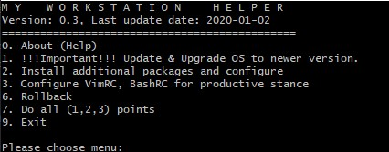

# My Workstation Helper

This project script helps to configure your Ubuntu system with some of default apps.

Here you can install & configure required packages and applications.

Use it as you want. Run myWorkstationHelpter.sh on your Ubuntu machine and install/configure default required packages.
You are free for modification.

I don't like Ubuntu terminal view and how Vim redactor looks like by default.
If you are same and like to see as image below you can use mine changes for __[bashrc](files/.bashrc)__, __[vimrc](files/.vimrc)__.

You can skip it at configuration stage.

## bashrc
Before changes:

After changes:

## vimrc
Before changes:

After changes:
