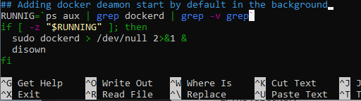

# Setup Docker on WSL2 for linux distribution + (_optional_) access from windows

## For windows user (Unix users should start from [Setup](#setup))
* Open a terminal (PowerShell as administrator) type the below command:

```
wsl --install
```

* Install Ubuntu as your default distribution. Below link will open the windows store:
[Get Ubuntu - Microsoft Store](https://www.microsoft.com/en-us/p/ubuntu/9nblggh4msv6#activetab=pivot:overviewtab)

* Once download and install finishes, click “Open” to start your setup of your Ubuntu distribution.
  It will ask you to enter your username and password. Please remember the password and store it in a secure place, that password will be required later

* Open Ubuntu as application from Windows search.

* Do follow below instruction

## Setup
```
sudo apt update
sudo apt upgrade
sudo apt install apt-transport-https ca-certificates curl software-properties-common
curl -fsSL https://download.docker.com/linux/ubuntu/gpg | sudo apt-key add -
sudo add-apt-repository "deb [arch=amd64] https://download.docker.com/linux/ubuntu focal stable"
sudo apt update
sudo apt install docker-ce docker-ce-cli docker-compose containerd.io
docker --version
sudo usermod -aG docker $USER
exit
```

open terminal again and check if docker id added by command:
```
id
```

then write follow:
```
sudo visudo
```
Edit file with follow line (use your UNIX user):


after save file and write ```exit```
then open terminal again and write/check follow commands:
```
sudo /usr/bin/dockerd
docker run hello-world
sudo /usr/bin/dockerd
docker run hello-world
nano .bashrc
```

Edit file with follow, this will help to start docker deamon in the background


Also you could write follow commands to check if nginx in linux accessed on windows:


then in windows web browser type: ``localhost:8080``

---
Bellow image to check all commands if you forgot something:

